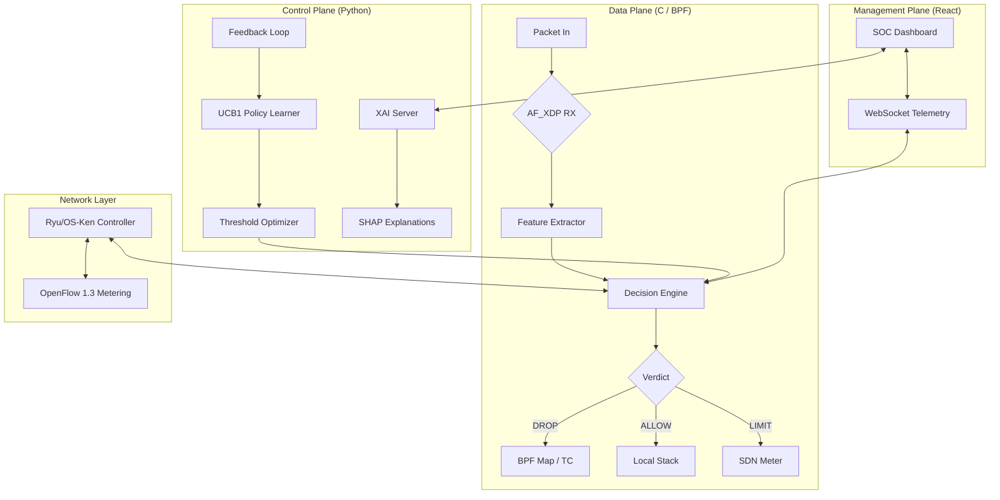

# Sentinel DDoS Mitigation Platform


Sentinel is a high-performance, behavior-aware DDoS mitigation system that bridges low-level kernel data paths with high-level reinforcement learning. It uses **AF_XDP zero-copy** for line-rate packet analysis and a **Multi-Armed Bandit (UCB1)** policy learner to autonomously tune mitigation thresholds.

---

## 🏗️ System Architecture



---

## 🚀 One-Click Launchers

The project includes pre-configured launch scripts that handle compilation, subsystem startup, and environment verification.

### Windows (WSL2 Environment)
Run **[Launch-Sentinel.bat](file:///Launch-Sentinel.bat)**. 
- Compiles C backend in WSL (Kali).
- Launches Backend, Frontend, and Explain API in separate windows.
- Best used when your WSL environment has GUI terminal support enabled.

### Linux / Kali
Run **[launch-sentinel.sh](file:///launch-sentinel.sh)**.
- Full multi-terminal spawn.
- Auto-attaches TC `clsact` for kernel-level drop fallback.
- Initializes SDN, ML, and Web subsystems.

### WSL Headless Note
On a standard WSL setup without GUI terminal support, `launch-sentinel.sh` will not be able to spawn `xfce4-terminal`, `gnome-terminal`, or similar terminal windows.

For WSL users, run the components manually in separate VS Code terminal tabs or inside `tmux` instead of relying on terminal spawning.

---

## 🛠️ Verified Setup Guide (The "No-Panic" Path)

Setting up an SDN/XDP environment on modern distributions (like Kali/Python 3.13) is notoriously difficult. Sentinel's setup path is **battle-tested** and handles common dependency conflicts.

### 1. System Dependencies
```bash
sudo apt update && sudo apt install -y openvswitch-switch openvswitch-common build-essential gcc make clang llvm libelf-dev libpcap-dev libpcap0.8-dev libcurl4-openssl-dev libssl-dev python3 python3-pip python3-venv git
```

These extra packages are required to build the eBPF datapath in `proxy/`, especially `clang`, `llvm`, and the ELF/pcap development headers.

### 2. OS-Ken SDN Controller (Python 3.13 Fix)
Standard OS-Ken/Ryu often fails due to missing internal apps.
```bash
# Clone and checkout stable version
git clone https://github.com/openstack/os-ken.git ~/os-ken-source
cd ~/os-ken-source
git checkout bf639392

# Manual Restoration of missing Ryu components
cd os_ken/app
wget https://raw.githubusercontent.com/faucetsdn/ryu/master/ryu/app/simple_switch_13.py
wget https://raw.githubusercontent.com/faucetsdn/ryu/master/ryu/app/ofctl_rest.py
wget https://raw.githubusercontent.com/faucetsdn/ryu/master/ryu/app/wsgi.py

# Patch for modern naming conventions
sed -i 's/from ryu/from os_ken/g' *.py
sed -i 's/import ryu/import os_ken/g' *.py
sed -i 's/RyuApp/OSKenApp/g' *.py
sed -i 's/RyuException/OSKenException/g' *.py
```

The controller startup flow in this repository uses patched `os-ken`, not the standalone `ryu` package.

### 2.1 Python Dependencies For XAI And Tooling
Install the Python dependencies used by `explain_api.py`, model loading, and data tooling:

```bash
python3 -m venv .venv
source .venv/bin/activate
pip install -r requirements.txt
```

If you want `scripts/start_ryu.py` to launch through a virtual environment, make sure that environment also contains `os-ken` and exposes `osken-manager`.

### 3. Mininet Installer (The Ubuntu Spoof)
Kali's installer is broken. We spoof Ubuntu to force a successful install.
```bash
# Spoof OS
sudo cp /etc/os-release /etc/os-release.bak
echo 'NAME="Ubuntu"; VERSION="22.04"; ID=ubuntu; ID_LIKE=debian; PRETTY_NAME="Ubuntu 22.04 LTS"' | sudo tee /etc/os-release

# Install without buggy reference implementations
sudo PYTHON=python3 PIP_BREAK_SYSTEM_PACKAGES=1 ~/mininet/util/install.sh -nv

# Restore OS info
sudo mv /etc/os-release.bak /etc/os-release
```

---

## 💻 Running Subsystems Manually

### Compilation
```bash
make  # Builds all libraries and binary
```

To build the kernel datapath objects in `proxy/`, run one of the following explicitly:

```bash
make kernel
# or
make loader
```

This builds `proxy/sentinel_xdp.o` and `proxy/sentinel_tc.o`. The root `make` command does not build these BPF objects by itself.

### Backend Pipeline
```bash
sudo ./sentinel_pipeline -i <interface> -q 0 -w 8765 --controller http://127.0.0.1:8080
```

### SDN Controller
```bash
python3 scripts/start_ryu.py
```

### XAI Explain API
```bash
source .venv/bin/activate
python3 explain_api.py --port 5001
```

### React Frontend
```bash
cd frontend
npm install
npm run dev
```

### Manual WSL Startup Order
For a headless WSL session, use separate terminal tabs and start the stack in this order:

```bash
# tab 1
cd /mnt/c/Users/navne/Downloads/Sentinel-main
source .venv/bin/activate
python3 explain_api.py --port 5001

# tab 2
cd /mnt/c/Users/navne/Downloads/Sentinel-main
python3 scripts/start_ryu.py

# tab 3
cd /mnt/c/Users/navne/Downloads/Sentinel-main
sudo ./sentinel_pipeline -i lo -q 0 -w 8765 --controller http://127.0.0.1:8080

# tab 4
cd /mnt/c/Users/navne/Downloads/Sentinel-main/frontend
npm install
npm run dev
```

---

## 🔍 Core Logic & Innovations

| Feature | Implementation | Benefit |
| :--- | :--- | :--- |
| **Datapath** | AF_XDP Zero-Copy | High-speed processing without kernel overhead. |
| **GC Logic** | Dirty-Bucket Bitmap | O(1) garbage collection of flow tables. |
| **Mitigation** | UCB1 Bandit | Autonomous threshold tuning based on performance. |
| **Classification** | Random Forest | Supervised ML for complex behavioral profiling. |
| **Explainability** | SHAP | Per-feature contribution analysis for SOC analysts. |

---

## 📂 Project Structure

- `sentinel_core/`: Core types and platform compatibility.
- `l1_native/`: Feature extraction (Entropy, Statistical analysis).
- `ml_engine/`: Random Forest implementation and Decision Engine.
- `feedback/`: UCB1 policy learner and reward calculations.
- `sdncontrol/`: Ryu-compatible OpenFlow rule management.
- `websocket/`: Real-time telemetry server.
- `frontend/`: React-based SOC Dashboard.
- `scripts/`: Maintenance and integration scripts.
- `docs/`: Technical deep-dives and developer guides.

---

## 📜 Error Handling History & Troubleshooting
- **Problem**: Python `pip install` fails on system-managed environments.
  - **Solution**: Use `PIP_BREAK_SYSTEM_PACKAGES=1` or dedicated venv.
- **Problem**: Mininet `cgroupfs-mount` failure on WSL.
  - **Solution**: Installer script patched via `sed` to skip cgroupfs mounting.
- **Problem**: TC `clsact` fallback missing.
  - **Solution**: Ensure `clang` is installed and run `scripts/attach_tc_clsact.sh`.
- **Problem**: `launch-sentinel.sh` does not open windows inside headless WSL.
  - **Solution**: Start each component manually in separate terminal tabs or use `tmux`.

---
*Developed for elite network defense.*
