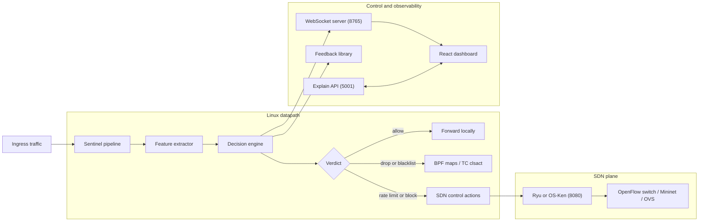

# Sentinel DDoS Mitigation Platform

Sentinel is a Linux-first DDoS detection and mitigation stack built around a C packet-processing pipeline, an SDN control path, a WebSocket telemetry layer, a React dashboard, and an optional Python explainability API.

It is designed to run best on Kali or another Debian-family Linux distribution, either natively or inside WSL2. The backend is not a native Windows program: build and runtime commands for the dataplane must run in Linux or WSL.

## Documentation Index (Single Source)

This README is the canonical all-in-one operational guide. New users should be able to install, run, verify, and troubleshoot Sentinel using this file alone.

- [What Sentinel Does](#what-sentinel-does)
- [Architecture](#architecture)
- [Repository Layout](#repository-layout)
- [Supported Environments](#supported-environments)
- [Quick Start](#quick-start)
- [Prerequisites](#prerequisites)
- [SDN Controller Setup](#sdn-controller-setup)
- [Build Commands](#build-commands)
- [Runtime Commands](#runtime-commands)
- [Kali-Specific Setup Notes](#kali-specific-setup-notes)
- [Runtime Configuration](#runtime-configuration)
- [Production External Deployment](#production-external-deployment)
- [Attack Simulation Playbook](#attack-simulation-playbook)
- [WebSocket Streams](#websocket-streams)
- [Verification Checklist](#verification-checklist)
- [Benchmarks and Integration Tests](#benchmarks-and-integration-tests)
- [Troubleshooting](#troubleshooting)
- [Current Verified Commands](#current-verified-commands)

## Documentation Policy

- This README is the primary entry point.
- When guidance conflicts, README should be treated as authoritative and updated first.

## What Sentinel Does

- Captures traffic through the Sentinel C pipeline and extracts behavioral features in real time.
- Scores flows with heuristic and ML-driven logic, including distributed-source fan-in evidence.
- Pushes live telemetry to the frontend over WebSocket.
- Sends mitigation actions to an OpenFlow controller when SDN mode is enabled.
- Serves SHAP-based model explanations and Gemini-assisted analysis through the optional Python API.

**Design and SLO:** Sentinel is designed for real-time classification (e.g. 1s telemetry, 5s top sources) and scales with AF_XDP and eBPF. Target operational goals: detect within 20s, mitigate within 2 minutes of detection. Policy is centralized: one pipeline applies a single policy (thresholds, allow/deny, rate limits); optional multi-node deployment can share the same config.

## Architecture

GitHub renders this diagram with Mermaid. Node labels that contain colons must be quoted, or parsing fails and the diagram does not display.



## Repository Layout

| Path | Purpose |
| --- | --- |
| `sentinel_pipeline.c` | Main pipeline executable and runtime orchestration |
| `l1_native/` | Packet feature extraction |
| `ml_engine/` | Threat scoring and classification |
| `sdncontrol/` | OpenFlow / controller integration |
| `websocket/` | Live telemetry server |
| `feedback/` | Feedback and threshold adaptation logic |
| `proxy/` | XDP and TC eBPF programs |
| `frontend/` | React + Vite SOC dashboard |
| `deploy/` | `run_sentinel_stack.sh` (unified launcher), nginx/oauth examples |
| `scripts/` | Startup, controller, TC attach, and integration helpers |
| `configs/` | Runtime configuration files such as reflection ports |

## Supported Environments

### Best-supported path

- Native Kali Linux
- Kali inside WSL2 for development and demos

### Important platform note

- `make`, `sudo ./sentinel_pipeline`, `tc`, Mininet, OVS, and eBPF steps belong in Linux or WSL.
- Native PowerShell is fine for the frontend and the Windows launcher, but not for the Linux dataplane itself.

### WSL limitations vs native Linux

- WSL2 is supported for development and demos, but native Linux is still the best target for full dataplane fidelity.
- eBPF and XDP behavior in WSL can differ from bare metal. If you need predictable kernel dataplane behavior, use native Linux.
- Mininet and OVS workflows are more reliable on native Linux. In WSL, networking edge cases and bridge behavior can vary by host setup.
- GUI terminal spawning from shell launchers may fail in headless WSL sessions; use the manual multi-terminal startup sequence.
- For production-like benchmarking and mitigation validation, prefer native Linux over WSL.

## Production External Deployment

For external-facing deployment and internet-path DDoS validation, use these production artifacts:

- `deploy/run_sentinel_stack.sh` as the single self-healing deploy+run entrypoint (installs/builds missing artifacts, starts all services, health-checks the full stack).
- `external_attack_guide.md` for Public IP validation, port forwarding, and WSL networking modes.
- `scripts/bridge_mode_guide.sh` for external bridge-mode topology command sequence.
- `scripts/test_external_flood.sh` for attacker-host flood generation during external validation.

Unified deploy+run:

```bash
sudo bash deploy/run_sentinel_stack.sh \
  --repo-path /opt/Sentinel-main \
  --ws-port 8765 \
  --explain-port 5001 \
  --frontend-port 5200 \
  --web-port 5173
```

Stop all stack components:

```bash
sudo bash deploy/run_sentinel_stack.sh --repo-path /opt/Sentinel-main --stop
```

## Quick Start

### Clone to running dashboard (recommended)

Use this flow for a fresh clone on Kali/Ubuntu:

```bash
git clone https://github.com/<your-org-or-user>/Sentinel-main.git
cd Sentinel-main
chmod +x deploy/run_sentinel_stack.sh

sudo bash deploy/run_sentinel_stack.sh \
  --repo-path "$(pwd)" \
  --ws-port 8765 \
  --explain-port 5001 \
  --frontend-port 5200 \
  --web-port 5173
```

Open the dashboard at `http://localhost` (or `http://localhost:<SENTINEL_WEB_PORT>` if overridden).

Stop the stack:

```bash
sudo bash deploy/run_sentinel_stack.sh --repo-path "$(pwd)" --stop
```

### Option 1: Linux / Kali multi-launcher

From the repo root:

```bash
chmod +x launch-sentinel.sh
./launch-sentinel.sh
```

What it does:

- builds the backend pipeline
- attempts to build the TC fallback object
- verifies frontend dependencies
- tries to attach `clsact` on `lo` by default
- launches controller, backend, explain API, frontend, and a simulation terminal

### Option 2: Windows + WSL launcher

From Windows Explorer or PowerShell in the repo root:

```powershell
.\Launch-Sentinel.bat
```

What it does:

- resolves the current repo path into your WSL distro
- builds the backend inside WSL
- starts the SDN controller inside WSL
- starts the backend with WebSocket and controller integration enabled
- starts the explain API on Windows
- starts the frontend and installs `node_modules` if needed

Default WSL distro: `kali-linux`

If your distro name is different, set it before launching:

```powershell
$env:SENTINEL_WSL_DISTRO = "Ubuntu"
.\Launch-Sentinel.bat
```

### Option 3: Manual startup

Use this when you want the most predictable path or when terminal spawning is unavailable.

Start the stack in this order from separate terminals.

Terminal 1, SDN controller (Linux/WSL):

```bash
cd /path/to/Sentinel-main
SENTINEL_OSKEN_SOURCE=/path/to/os-ken-source .venv-sdn/bin/python3 scripts/start_ryu.py
```

Terminal 2, TC eBPF attachment and backend pipeline (Linux/WSL, requires sudo):

```bash
cd /path/to/Sentinel-main
sudo bash scripts/attach_tc_clsact.sh lo
sudo ./sentinel_pipeline -i lo -w 8765
```

Terminal 3, explain API (Windows or Linux):

```bash
cd /path/to/Sentinel-main
export SENTINEL_WS_API_KEY="your_api_key_here"
export GEMINI_API_KEY="your_gemini_api_key"  # optional, for AI analysis
python3 explain_api.py --host 127.0.0.1 --port 5001
```

Terminal 4, frontend (Windows or Linux):

```bash
cd /path/to/Sentinel-main/frontend
npm install
npm run dev
```

Frontend URL: `http://localhost:5173`

**Important:** The frontend requires a `.env` file at `frontend/.env` with:

```
VITE_WS_URL=ws://localhost:8765
VITE_EXPLAIN_API_URL=http://localhost:5001
VITE_WS_API_KEY=your_api_key_here
```

Make sure `VITE_WS_API_KEY` matches the `SENTINEL_WS_API_KEY` used by the backend and explain API.

## Prerequisites

### System packages for Kali / Debian / Ubuntu

```bash
sudo apt update
sudo apt install -y \
  build-essential gcc make clang llvm libelf-dev \
  libpcap-dev libpcap0.8-dev libcurl4-openssl-dev \
  libssl-dev pkg-config curl git python3 python3-pip python3-venv \
  openvswitch-switch openvswitch-common
```

Notes:

- `clang` and `llvm` are needed for `proxy/` eBPF builds.
- OVS and Mininet are only required for controller-backed or benchmark scenarios.

### Frontend toolchain

Install Node.js 20+ and npm, then verify:

```bash
node -v
npm -v
```

Install frontend dependencies:

```bash
cd frontend
npm install
cd ..
```

**WSL vs Windows:** If you build the dashboard with `npm run build` or `npm run dev` inside WSL, run `npm install` in that same environment. A `node_modules` tree produced on Windows can miss Linux Rollup binaries (`@rollup/rollup-linux-x64-gnu`) and fail at build time. If that happens, from WSL run: `rm -rf frontend/node_modules frontend/package-lock.json && cd frontend && npm install`.

### Python environment for explainability

```bash
python3 -m venv .venv
source .venv/bin/activate
pip install -r requirements.txt
```

The explain API currently depends on:

- `numpy`
- `scikit-learn`
- `shap`
- `joblib`
- `pandas`
- `xgboost`

## ML Training And Runtime Export

Sentinel keeps a fixed runtime feature schema of 20 engineered features even when the source datasets use different raw columns. Each supported dataset loader maps or derives its own source columns into the same 20-feature runtime vector used by:

- `benchmarks/sentinel_model.joblib`
- `benchmarks/model_benchmark_report.json`
- `frontend/public/model_benchmark_report.json`
- `ml_engine/ml_model.h`

Files that cannot map enough grounded features are rejected during training.

### Real mixed-dataset training

The verified mixed training path uses:

- `himadri07/ciciot2023`
- `dhoogla/nfunswnb15v2`

You can download them through the notebook in `ml_engine/sentinel_trainer.ipynb` or place the extracted files under:

- `data/ciciot2023`
- `data/unsw`

Then run the verified training command:

```bash
python3 train_ml.py \
  --dataset-dir ./data/ciciot2023 \
  --dataset-dir ./data/unsw \
  --export-joblib benchmarks/sentinel_model.joblib
```

**Note**: Training project everything into a fixed 20-feature runtime schema. Files with insufficient schema mapping (below `MIN_MAPPED_FEATURES`) are automatically rejected.

### Runtime model selection

Training benchmarks all enabled models on the held-out split, records real measured inference latency, and chooses the runtime deployment model from the exportable candidates using validation accuracy under a latency budget.

Useful knobs:

```bash
export SENTINEL_RUNTIME_MAX_INFERENCE_MS=0.20
export SENTINEL_RUNTIME_ACCURACY_TIE_EPS=0.002
```

## SDN Controller Setup

Sentinel expects a controller exposing `/stats/*` endpoints on `http://127.0.0.1:8080`.

The helper script `scripts/start_ryu.py` now searches for controller runtimes in this order:

1. repo-local compatibility launcher: `scripts/osken_manager_compat.py` via `.venv-controller/bin/python` (preferred)
2. repo-local compatibility launcher via `.venv/bin/python`
3. repo-local `.venv-controller/bin/ryu-manager`
4. repo-local `.venv-controller/bin/osken-manager`
5. repo-local `.venv/bin/ryu-manager`
6. repo-local `.venv/bin/osken-manager`
7. system `ryu-manager`
8. system `osken-manager`
9. `python -m ryu.cmd.manager`
10. `python -m os_ken.cmd.manager`

### Recommended OS-Ken path on Kali

If standard packages are missing `simple_switch_13` or `ofctl_rest`, use a patched source tree.

```bash
git clone https://github.com/openstack/os-ken.git ~/os-ken-source
cd ~/os-ken-source
git checkout bf639392
cd os_ken/app
wget https://raw.githubusercontent.com/faucetsdn/ryu/master/ryu/app/simple_switch_13.py
wget https://raw.githubusercontent.com/faucetsdn/ryu/master/ryu/app/ofctl_rest.py
wget https://raw.githubusercontent.com/faucetsdn/ryu/master/ryu/app/wsgi.py
sed -i 's/from ryu/from os_ken/g' *.py
sed -i 's/import ryu/import os_ken/g' *.py
sed -i 's/RyuApp/OSKenApp/g' *.py
sed -i 's/RyuException/OSKenException/g' *.py
```

On Windows development hosts using the PowerShell launcher, the repo-local `os-ken-source/` directory is **mandatory** because the packaged `os_ken` wheel often lacks `os_ken.app.wsgi`, `os_ken.app.ofctl_rest`, and `os_ken.app.simple_switch_13`. The launcher automatically injects this into `PYTHONPATH`.

If your patched source is not at `~/os-ken-source`, point Sentinel at it explicitly:

```bash
export SENTINEL_OSKEN_SOURCE=/custom/path/to/os-ken-source
python3 scripts/start_ryu.py
```

Quick controller health check:

```bash
curl -s http://127.0.0.1:8080/stats/switches
```

If this endpoint does not respond, stop old controller instances and relaunch:

```bash
pkill -f 'osken-manager|os_ken.cmd.manager|start_ryu.py|osken_manager_compat.py' || true
/path/to/Sentinel-main/.venv-controller/bin/python scripts/start_ryu.py
```

## Build Commands

Run these from the repo root inside Linux or WSL.

Build all libraries and the pipeline:

```bash
make
```

Show supported make targets:

```bash
make help
```

Build only the pipeline:

```bash
make pipeline
```

Build only libraries:

```bash
make libs
```

Build XDP and TC eBPF objects:

```bash
make kernel
```

Run the sanity test target:

```bash
make test
```

## Runtime Commands

### Backend pipeline

Basic loopback run for local demos:

```bash
sudo ./sentinel_pipeline -i lo -q 0 -w 8765 --controller http://127.0.0.1:8080 -v
```

If you rebuilt the project, restart the running pipeline so it picks up the new binary:

```bash
sudo pkill -f 'sentinel_pipeline -i lo -q 0 -w 8765 --controller http://127.0.0.1:8080 -v' || true
sudo ./sentinel_pipeline -i lo -q 0 -w 8765 --controller http://127.0.0.1:8080 -v
```

Typical Mininet / OVS run:

```bash
sudo ./sentinel_pipeline -i eth0 -q 0 -w 8765 --controller http://127.0.0.1:8080 --dpid 1 -v
```

Pipeline help:

```bash
./sentinel_pipeline -h
```

### Explain API

```bash
export SENTINEL_WS_API_KEY="your_api_key_here"
python3 explain_api.py --host 127.0.0.1 --port 5001
```

Help:

```bash
python3 explain_api.py --help
```

Health check:

```bash
curl -s http://127.0.0.1:5001/health
```

**Event history (Mitigation timeline):** The dashboard’s Mitigation Control page shows a timeline of block/rate-limit actions. After a reload, that timeline is restored from the Explain API’s `/events` endpoint. If the Explain API is not running or not reachable from the browser (e.g. CORS or network), the timeline will show only live events from the WebSocket until the next reload. The UI shows an “Event history unavailable” hint when the Explain API was configured but the event fetch failed.

### Frontend

```bash
cd frontend
npm install
npm run dev
```

Production build:

```bash
cd frontend
npm run build
```

Lint:

```bash
cd frontend
npm run lint
```

### TC fallback attach

Build the TC object first:

```bash
make -C proxy sentinel_tc.o
```

Attach it:

```bash
sudo ./scripts/attach_tc_clsact.sh lo
```

Detach it:

```bash
sudo tc qdisc del dev lo clsact 2>/dev/null || true
```

## Kali-Specific Setup Notes

### Mininet install workaround

Mininet can be painful on recent Kali builds. If the standard install path fails, the known workaround is to temporarily spoof Ubuntu for the installer.

```bash
sudo cp /etc/os-release /etc/os-release.bak
echo 'NAME="Ubuntu"; VERSION="22.04"; ID=ubuntu; ID_LIKE=debian; PRETTY_NAME="Ubuntu 22.04 LTS"' | sudo tee /etc/os-release
sudo PYTHON=python3 PIP_BREAK_SYSTEM_PACKAGES=1 ~/mininet/util/install.sh -nv
sudo mv /etc/os-release.bak /etc/os-release
```

### If `pip install` is blocked by system package policy

Prefer the project virtual environment:

```bash
python3 -m venv .venv
source .venv/bin/activate
pip install -r requirements.txt
```

### If `make` is not found in Windows PowerShell

That is expected. Use WSL:

```powershell
wsl -d kali-linux -u root -e bash -lc "cd /mnt/c/path/to/Sentinel-main && make"
```

## Runtime Configuration

### Phase 0 baseline freeze and rollback rails

Capture a reproducible baseline snapshot before enabling additional integrations:

```bash
bash scripts/freeze_baseline.sh
```

This writes a timestamped report under:

```text
benchmarks/baselines/
```

To force rollback to baseline profile in the current shell:

```bash
source scripts/rollback_to_baseline.sh
```

Profile files are stored at:

```text
scripts/profiles/baseline.env
scripts/profiles/progressive.env
scripts/profiles/full.env
```

Select a profile before launch:

```bash
export SENTINEL_PROFILE=baseline
./launch-sentinel.sh
```

On Windows:

```powershell
$env:SENTINEL_PROFILE = "baseline"
.\Launch-Sentinel.bat
```

### Reflection and amplification ports

Default file:

```text
configs/reflection_ports.conf
```

Override via file:

```bash
export SENTINEL_REFLECTION_PORTS_FILE=/path/to/reflection_ports.conf
```

Signature feed integration option (reflection signatures file):

```bash
export SENTINEL_SIGNATURES_FILE=/path/to/signature_methods.json
# or
export SENTINEL_REFLECTION_PORTS_FILE=/path/to/signature_methods.json
```

If neither is set, the pipeline uses `signatures/methods.json` by default. Place a compatible reflection-signature JSON (e.g. protocol/port and hex-payload patterns) in that path to enable signature-based hints. The decision engine parses compatible reflection-signature JSON and imports recognized service ports directly.

Override directly:

```bash
export SENTINEL_REFLECTION_PORTS="53,123,1900,11211"
```

### External integration feature flags

All external module integrations are phase-gated and disabled by default. Enable only modules under active validation.

```bash
export SENTINEL_INTEGRATION_PROFILE=baseline
export SENTINEL_ENABLE_INTEL_FEED=0
export SENTINEL_ENABLE_MODEL_EXTENSION=0
export SENTINEL_ENABLE_CONTROLLER_EXTENSION=0
export SENTINEL_ENABLE_SIGNATURE_FEED=0
export SENTINEL_ENABLE_DATAPLANE_EXTENSION=0
```

Optional controller-extension command bridge:

```bash
export SENTINEL_CONTROLLER_EXTENSION_CMD="/path/to/controller_extension.sh"
export SENTINEL_CONTROLLER_EXTENSION_MIN_INTERVAL_MS=2000
```

When enabled, Sentinel exports event context through environment variables before invoking the command:

- `SENTINEL_EXTENSION_SRC_IP`
- `SENTINEL_EXTENSION_ACTION`
- `SENTINEL_EXTENSION_ATTACK_TYPE`
- `SENTINEL_EXTENSION_THREAT_SCORE`
- `SENTINEL_EXTENSION_CONFIDENCE`
- `SENTINEL_EXTENSION_RULE_ID`
- `SENTINEL_EXTENSION_SDN_PUSH_OK`

Suggested profile progression:

- `baseline`: core runtime only
- `progressive`: module-by-module enablement during validation
- `full`: all integration modules enabled after quality gates are green

### Frontend endpoint overrides

The frontend auto-discovers local defaults, but you can override them with Vite env vars when needed.

Example:

```bash
cd frontend
export VITE_EXPLAIN_API_URL=http://127.0.0.1:5001
npm run dev
```

## Attack Simulation Playbook

Run these only in environments you own or are explicitly authorized to test.

Prerequisites:

- backend running with telemetry enabled, for example: `sudo ./sentinel_pipeline -i lo -q 0 -w 8765`
- frontend running on `http://localhost:5173`

SYN flood quick test:

```bash
sudo hping3 -S -p 80 --flood <TARGET_IP>
```

UDP flood quick test:

```bash
sudo hping3 --udp -p 53 --flood <TARGET_IP>
```

ICMP flood quick test:

```bash
ping -f <TARGET_IP>
```

Expected UI behavior:

- traffic and risk indicators spike
- top source tables show the attacking source
- mitigation logs show attack type/protocol/threat score
- blocked or rate-limited tables update when mitigation is enabled

## WebSocket Streams

When the backend runs with `-w 8765`, telemetry streams include:

- `metrics`
- `activity_logs`
- `blocked_ips`
- `rate_limited_ips`
- `monitored_ips`
- `whitelisted_ips`
- `traffic_rate`
- `protocol_distribution`
- `top_sources`
- `feature_importance`
- `active_connections`
- `mitigation_status`
- `integration_status`
- `packet_events` (sampled packet-evidence stream with real source/destination IP text)

**Commands (dashboard → pipeline):** The Settings page syncs thresholds via `set_syn_threshold`, `set_conn_threshold`, `set_pps_threshold`, `set_entropy_threshold`, and `set_contributor_threshold` (0–100; only consider IPs contributing at least that % of top-source traffic for Block top contributors; 0 = disabled). Mitigation Control supports `block_ip` (ip), `block_ip_port` (value: `ip` or `ip:port` for SDN port-level drop), `block_all_flagged`, `clear_all_blocks`, `apply_rate_limit`, and `enable_auto_mitigation` / `disable_auto_mitigation`.

**Telemetry backpressure and limits:** The WebSocket server queues up to 1000 telemetry messages (`MAX_PENDING_MESSAGES`). When the queue is full, the oldest message is dropped and the new one is enqueued (drop-oldest policy); the server increments a dropped counter (no blocking). List payloads are capped so each JSON message fits in a 16 KB buffer: at most 64 entries per IP list (blocked/rate-limited/monitored/whitelisted), 32 top sources, and 64 active connections. Max concurrent clients default to 100 (configurable). Commands from the dashboard are rate-limited per client (10 per second); excess commands in the same second are dropped. The frontend reconnects with exponential backoff (up to 30 s) and keeps retrying. For high-load or many clients, expect some telemetry drops when the queue is full; the UI reflects the latest data that was sent.

**Frontend update cadence:** Incoming WebSocket messages are batched and applied on `requestAnimationFrame` so high-volume streams (for example sampled `packet_events`) do not freeze the main thread. The pipeline adjusts `packet_event` sampling by observed PPS so the evidence stream stays useful without overwhelming the browser.

## Verification Checklist

After startup, verify each layer.

Controller:

```bash
curl -s http://127.0.0.1:8080/stats/switches
```

Explain API:

```bash
curl -s http://127.0.0.1:5001/health
```

WebSocket server listening:

```bash
ss -ltn | grep 8765
```

All required local ports:

```bash
ss -ltn | egrep ':(5001|5173|8080|8765)\b'
```

Frontend build health:

```bash
cd frontend
npm run build
```

IPv4/IPv6 packet-evidence parity check (transparent sampling):

```bash
sudo tcpdump -ni eth4 -c 100 'ip or ip6'
```

Then open the dashboard Traffic Analysis page and compare the `Packet Evidence` panel:

- `src_ip`/`dst_ip` values should match canonical addresses seen by `tcpdump`
- protocol values should align (TCP/UDP/ICMP/ICMPv6 or protocol number)
- packet lengths should be directionally consistent
- stream is sampled for UI stability, so packet count is expected to be lower than full `tcpdump` capture

Strict UI identity check (Top Sources / Activity / Connections):

```bash
# Run while the stack is active and traffic is flowing
sudo tcpdump -ni eth4 -c 100 'ip or ip6'
```

Expected dashboard behavior in non-simulation mode:

- Top source and connection rows show canonical IPv4/IPv6 text addresses
- Activity log source addresses are canonical IPv4/IPv6 text
- `ipv6_hash:*` should not appear in these user-facing views

Backend test target:

```bash
make test
```

## Benchmarks and Integration Tests

Run controller-path validation after the controller and topology are up:

```bash
./scripts/test_ryu_integration.sh
```

Run the benchmark harness:

```bash
sudo benchmarks/run_mininet_benchmark.sh
```

Results are written under `benchmarks/results/`.

## Troubleshooting

### `launch-sentinel.sh` cannot open terminals

Your session is probably headless or lacks a supported emulator. Use the manual four-terminal startup sequence instead.

### `python3 scripts/start_ryu.py` cannot find a manager runtime

Install one of the following:

- Ryu system-wide
- OS-Ken system-wide
- `ryu-manager` or `osken-manager` in `.venv-controller`
- `ryu-manager` or `osken-manager` in `.venv`

### Controller is up but `/stats/*` returns 404

The controller started without `ofctl_rest`. Use `scripts/start_ryu.py` instead of starting a bare controller manually.

### `make kernel` fails on `clang-18`

The `proxy/Makefile` currently expects `clang-18`. If your distro only provides `clang`, either install `clang-18` or adjust `CC` in `proxy/Makefile` for your environment.

### WebSocket dashboard shows no traffic

Check these in order:

1. backend is running with `-w 8765`
2. the monitored interface actually sees traffic
3. the frontend is pointed at the correct host
4. port `8765` is listening

### Explain API says SHAP is unavailable

Install the Python requirements inside `.venv` and restart the API:

```bash
source .venv/bin/activate
pip install -r requirements.txt
python3 explain_api.py --port 5001
```

## Current Verified Commands

These commands were checked against the current repo during this documentation pass:

- `python explain_api.py --help`
- `make help` in Kali/WSL
- `npm run lint`
- `npm run build`

That does not guarantee every optional subsystem is installed on every machine, but the command surface documented here now matches the code and scripts in this repository.
