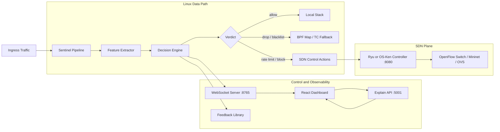

# Sentinel DDoS Mitigation Platform

Sentinel is a Linux-first DDoS detection and mitigation stack built around a C packet-processing pipeline, an SDN control path, a WebSocket telemetry layer, a React dashboard, and an optional Python explainability API.

It is designed to run best on Kali or another Debian-family Linux distribution, either natively or inside WSL2. The backend is not a native Windows program: build and runtime commands for the dataplane must run in Linux or WSL.

## Documentation Index (Single Source)

This README is the canonical all-in-one operational guide. New users should be able to install, run, verify, and troubleshoot Sentinel using this file alone.

- [What Sentinel Does](#what-sentinel-does)
- [Architecture](#architecture)
- [Repository Layout](#repository-layout)
- [Supported Environments](#supported-environments)
- [Quick Start](#quick-start)
- [Prerequisites](#prerequisites)
- [SDN Controller Setup](#sdn-controller-setup)
- [Build Commands](#build-commands)
- [Runtime Commands](#runtime-commands)
- [Kali-Specific Setup Notes](#kali-specific-setup-notes)
- [Runtime Configuration](#runtime-configuration)
- [Attack Simulation Playbook](#attack-simulation-playbook)
- [WebSocket Streams](#websocket-streams)
- [Verification Checklist](#verification-checklist)
- [Benchmarks and Integration Tests](#benchmarks-and-integration-tests)
- [Troubleshooting](#troubleshooting)
- [Current Verified Commands](#current-verified-commands)

## Documentation Policy

- This README is the primary entry point.
- When guidance conflicts, README should be treated as authoritative and updated first.

## What Sentinel Does

- Captures traffic through the Sentinel C pipeline and extracts behavioral features in real time.
- Scores flows with heuristic and ML-driven logic, including distributed-source fan-in evidence.
- Pushes live telemetry to the frontend over WebSocket.
- Sends mitigation actions to an OpenFlow controller when SDN mode is enabled.
- Serves SHAP-based model explanations and Gemini-assisted analysis through the optional Python API.

## Architecture



## Repository Layout

| Path | Purpose |
| --- | --- |
| `sentinel_pipeline.c` | Main pipeline executable and runtime orchestration |
| `l1_native/` | Packet feature extraction |
| `ml_engine/` | Threat scoring and classification |
| `sdncontrol/` | OpenFlow / controller integration |
| `websocket/` | Live telemetry server |
| `feedback/` | Feedback and threshold adaptation logic |
| `proxy/` | XDP and TC eBPF programs |
| `frontend/` | React + Vite SOC dashboard |
| `scripts/` | Startup, controller, TC attach, and integration helpers |
| `configs/` | Runtime configuration files such as reflection ports |

## Supported Environments

### Best-supported path

- Native Kali Linux
- Kali inside WSL2 for development and demos

### Important platform note

- `make`, `sudo ./sentinel_pipeline`, `tc`, Mininet, OVS, and eBPF steps belong in Linux or WSL.
- Native PowerShell is fine for the frontend and the Windows launcher, but not for the Linux dataplane itself.

### WSL limitations vs native Linux

- WSL2 is supported for development and demos, but native Linux is still the best target for full dataplane fidelity.
- eBPF and XDP behavior in WSL can differ from bare metal. If you need predictable kernel dataplane behavior, use native Linux.
- Mininet and OVS workflows are more reliable on native Linux. In WSL, networking edge cases and bridge behavior can vary by host setup.
- GUI terminal spawning from shell launchers may fail in headless WSL sessions; use the manual multi-terminal startup sequence.
- For production-like benchmarking and mitigation validation, prefer native Linux over WSL.

## Quick Start

### Option 1: Linux / Kali multi-launcher

From the repo root:

```bash
chmod +x launch-sentinel.sh
./launch-sentinel.sh
```

What it does:

- builds the backend pipeline
- attempts to build the TC fallback object
- verifies frontend dependencies
- tries to attach `clsact` on `lo` by default
- launches controller, backend, explain API, frontend, and a simulation terminal

### Option 2: Windows + WSL launcher

From Windows Explorer or PowerShell in the repo root:

```powershell
.\Launch-Sentinel.bat
```

What it does:

- resolves the current repo path into your WSL distro
- builds the backend inside WSL
- starts the SDN controller inside WSL
- starts the backend with WebSocket and controller integration enabled
- starts the explain API on Windows
- starts the frontend and installs `node_modules` if needed

Default WSL distro: `kali-linux`

If your distro name is different, set it before launching:

```powershell
$env:SENTINEL_WSL_DISTRO = "Ubuntu"
.\Launch-Sentinel.bat
```

### Option 3: Manual startup

Use this when you want the most predictable path or when terminal spawning is unavailable.

Start the stack in this order from separate terminals.

Terminal 1, explain API:

```bash
cd /path/to/Sentinel-main
source .venv/bin/activate
python3 explain_api.py --host 127.0.0.1 --port 5001
```

Terminal 2, SDN controller:

```bash
cd /path/to/Sentinel-main
python3 scripts/start_ryu.py
```

Terminal 3, backend pipeline:

```bash
cd /path/to/Sentinel-main
sudo ./sentinel_pipeline -i lo -q 0 -w 8765 --controller http://127.0.0.1:8080 -v
```

Terminal 4, frontend:

```bash
cd /path/to/Sentinel-main/frontend
npm install
npm run dev
```

Frontend URL: `http://localhost:5173`

## Prerequisites

### System packages for Kali / Debian / Ubuntu

```bash
sudo apt update
sudo apt install -y \
  build-essential gcc make clang llvm libelf-dev \
  libpcap-dev libpcap0.8-dev libcurl4-openssl-dev \
  libssl-dev pkg-config curl git python3 python3-pip python3-venv \
  openvswitch-switch openvswitch-common
```

Notes:

- `clang` and `llvm` are needed for `proxy/` eBPF builds.
- OVS and Mininet are only required for controller-backed or benchmark scenarios.

### Frontend toolchain

Install Node.js 20+ and npm, then verify:

```bash
node -v
npm -v
```

Install frontend dependencies:

```bash
cd frontend
npm install
cd ..
```

### Python environment for explainability

```bash
python3 -m venv .venv
source .venv/bin/activate
pip install -r requirements.txt
```

The explain API currently depends on:

- `numpy`
- `scikit-learn`
- `shap`
- `joblib`
- `pandas`

## SDN Controller Setup

Sentinel expects a controller exposing `/stats/*` endpoints on `http://127.0.0.1:8080`.

The helper script `scripts/start_ryu.py` now searches for controller runtimes in this order:

1. repo-local `.venv-controller/bin/ryu-manager`
2. repo-local `.venv-controller/bin/osken-manager`
3. repo-local `.venv/bin/ryu-manager`
4. repo-local `.venv/bin/osken-manager`
5. system `ryu-manager`
6. system `osken-manager`
7. `python -m ryu.cmd.manager`
8. `python -m os_ken.cmd.manager`

### Recommended OS-Ken path on Kali

If standard packages are missing `simple_switch_13` or `ofctl_rest`, use a patched source tree.

```bash
git clone https://github.com/openstack/os-ken.git ~/os-ken-source
cd ~/os-ken-source
git checkout bf639392
cd os_ken/app
wget https://raw.githubusercontent.com/faucetsdn/ryu/master/ryu/app/simple_switch_13.py
wget https://raw.githubusercontent.com/faucetsdn/ryu/master/ryu/app/ofctl_rest.py
wget https://raw.githubusercontent.com/faucetsdn/ryu/master/ryu/app/wsgi.py
sed -i 's/from ryu/from os_ken/g' *.py
sed -i 's/import ryu/import os_ken/g' *.py
sed -i 's/RyuApp/OSKenApp/g' *.py
sed -i 's/RyuException/OSKenException/g' *.py
```

If your patched source is not at `~/os-ken-source`, point Sentinel at it explicitly:

```bash
export SENTINEL_OSKEN_SOURCE=/custom/path/to/os-ken-source
python3 scripts/start_ryu.py
```

Quick controller health check:

```bash
curl -s http://127.0.0.1:8080/stats/switches
```

## Build Commands

Run these from the repo root inside Linux or WSL.

Build all libraries and the pipeline:

```bash
make
```

Show supported make targets:

```bash
make help
```

Build only the pipeline:

```bash
make pipeline
```

Build only libraries:

```bash
make libs
```

Build XDP and TC eBPF objects:

```bash
make kernel
```

Run the sanity and integration test target:

```bash
make test
```

## Runtime Commands

### Backend pipeline

Basic loopback run for local demos:

```bash
sudo ./sentinel_pipeline -i lo -q 0 -w 8765 --controller http://127.0.0.1:8080 -v
```

Typical Mininet / OVS run:

```bash
sudo ./sentinel_pipeline -i eth0 -q 0 -w 8765 --controller http://127.0.0.1:8080 --dpid 1 -v
```

Pipeline help:

```bash
./sentinel_pipeline -h
```

### Explain API

```bash
source .venv/bin/activate
python3 explain_api.py --host 127.0.0.1 --port 5001
```

Help:

```bash
python3 explain_api.py --help
```

Health check:

```bash
curl -s http://127.0.0.1:5001/health
```

### Frontend

```bash
cd frontend
npm install
npm run dev
```

Production build:

```bash
cd frontend
npm run build
```

Lint:

```bash
cd frontend
npm run lint
```

### TC fallback attach

Build the TC object first:

```bash
make -C proxy sentinel_tc.o
```

Attach it:

```bash
sudo ./scripts/attach_tc_clsact.sh lo
```

Detach it:

```bash
sudo tc qdisc del dev lo clsact 2>/dev/null || true
```

## Kali-Specific Setup Notes

### Mininet install workaround

Mininet can be painful on recent Kali builds. If the standard install path fails, the known workaround is to temporarily spoof Ubuntu for the installer.

```bash
sudo cp /etc/os-release /etc/os-release.bak
echo 'NAME="Ubuntu"; VERSION="22.04"; ID=ubuntu; ID_LIKE=debian; PRETTY_NAME="Ubuntu 22.04 LTS"' | sudo tee /etc/os-release
sudo PYTHON=python3 PIP_BREAK_SYSTEM_PACKAGES=1 ~/mininet/util/install.sh -nv
sudo mv /etc/os-release.bak /etc/os-release
```

### If `pip install` is blocked by system package policy

Prefer the project virtual environment:

```bash
python3 -m venv .venv
source .venv/bin/activate
pip install -r requirements.txt
```

### If `make` is not found in Windows PowerShell

That is expected. Use WSL:

```powershell
wsl -d kali-linux -u root -e bash -lc "cd /mnt/c/path/to/Sentinel-main && make"
```

## Runtime Configuration

### Reflection and amplification ports

Default file:

```text
configs/reflection_ports.conf
```

Override via file:

```bash
export SENTINEL_REFLECTION_PORTS_FILE=/path/to/reflection_ports.conf
```

Override directly:

```bash
export SENTINEL_REFLECTION_PORTS="53,123,1900,11211"
```

### Frontend endpoint overrides

The frontend auto-discovers local defaults, but you can override them with Vite env vars when needed.

Example:

```bash
cd frontend
export VITE_EXPLAIN_API_URL=http://127.0.0.1:5001
npm run dev
```

## Attack Simulation Playbook

Run these only in environments you own or are explicitly authorized to test.

Prerequisites:

- backend running with telemetry enabled, for example: `sudo ./sentinel_pipeline -i lo -q 0 -w 8765`
- frontend running on `http://localhost:5173`

SYN flood quick test:

```bash
sudo hping3 -S -p 80 --flood <TARGET_IP>
```

UDP flood quick test:

```bash
sudo hping3 --udp -p 53 --flood <TARGET_IP>
```

ICMP flood quick test:

```bash
ping -f <TARGET_IP>
```

Expected UI behavior:

- traffic and risk indicators spike
- top source tables show the attacking source
- mitigation logs show attack type/protocol/threat score
- blocked or rate-limited tables update when mitigation is enabled

## WebSocket Streams

When the backend runs with `-w 8765`, telemetry streams include:

- `metrics`
- `activity_logs`
- `blocked_ips`
- `rate_limited_ips`
- `monitored_ips`
- `whitelisted_ips`
- `traffic_rate`
- `protocol_distribution`
- `top_sources`
- `feature_importance`
- `active_connections`
- `mitigation_status`

## Verification Checklist

After startup, verify each layer.

Controller:

```bash
curl -s http://127.0.0.1:8080/stats/switches
```

Explain API:

```bash
curl -s http://127.0.0.1:5001/health
```

WebSocket server listening:

```bash
ss -ltn | grep 8765
```

Frontend build health:

```bash
cd frontend
npm run build
```

Backend test target:

```bash
make test
```

## Benchmarks and Integration Tests

Run the controller integration test after the controller and topology are up:

```bash
./scripts/test_ryu_integration.sh
```

Run the benchmark harness:

```bash
sudo benchmarks/run_mininet_benchmark.sh
```

Results are written under `benchmarks/results/`.

## Troubleshooting

### `launch-sentinel.sh` cannot open terminals

Your session is probably headless or lacks a supported emulator. Use the manual four-terminal startup sequence instead.

### `python3 scripts/start_ryu.py` cannot find a manager runtime

Install one of the following:

- Ryu system-wide
- OS-Ken system-wide
- `ryu-manager` or `osken-manager` in `.venv-controller`
- `ryu-manager` or `osken-manager` in `.venv`

### Controller is up but `/stats/*` returns 404

The controller started without `ofctl_rest`. Use `scripts/start_ryu.py` instead of starting a bare controller manually.

### `make kernel` fails on `clang-18`

The `proxy/Makefile` currently expects `clang-18`. If your distro only provides `clang`, either install `clang-18` or adjust `CC` in `proxy/Makefile` for your environment.

### WebSocket dashboard shows no traffic

Check these in order:

1. backend is running with `-w 8765`
2. the monitored interface actually sees traffic
3. the frontend is pointed at the correct host
4. port `8765` is listening

### Explain API says SHAP is unavailable

Install the Python requirements inside `.venv` and restart the API:

```bash
source .venv/bin/activate
pip install -r requirements.txt
python3 explain_api.py --port 5001
```

## Current Verified Commands

These commands were checked against the current repo during this documentation pass:

- `python explain_api.py --help`
- `make help` in Kali/WSL
- `npm run lint`
- `npm run build`

That does not guarantee every optional subsystem is installed on every machine, but the command surface documented here now matches the code and scripts in this repository.
